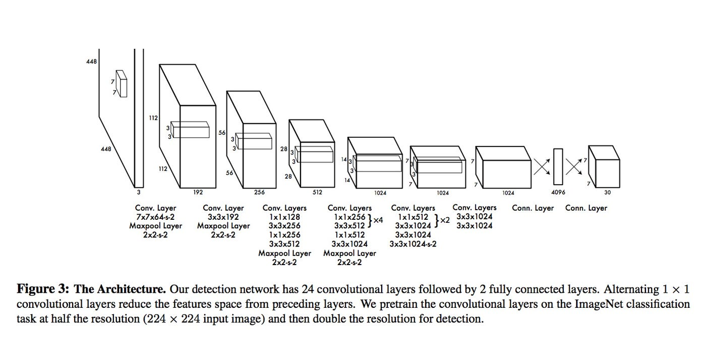
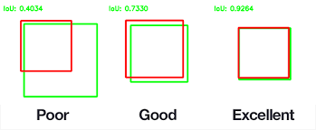
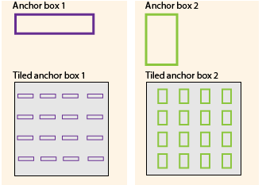
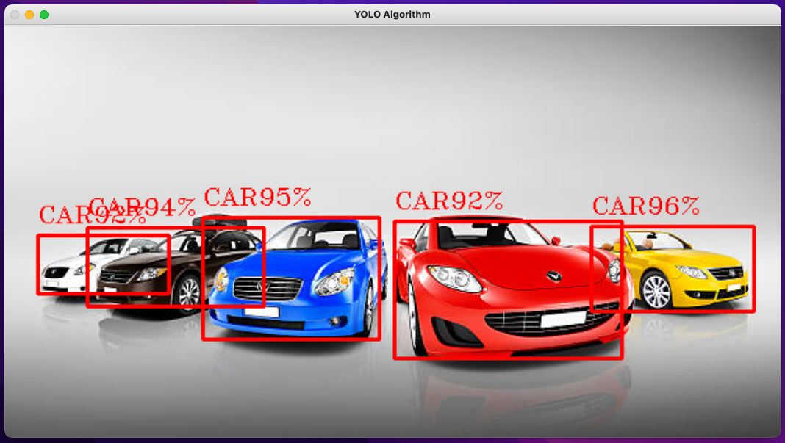
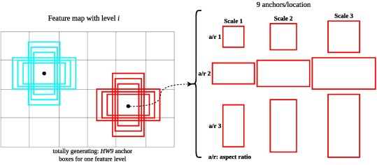
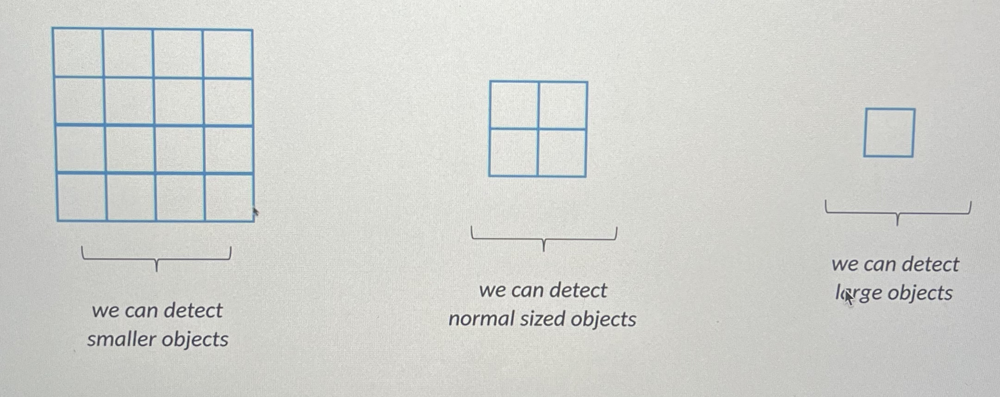
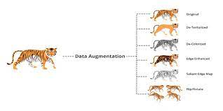
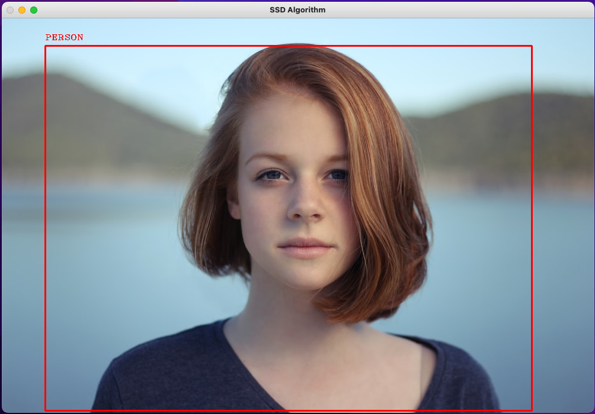

# YOLO and SSD Image and Video Computer Vision Classification

**An implementation of a the YOLO and SSD Computer Vision Algorithms for Classification on Images and Videos**

---

**Theoretical Topics:** *Computer Vision, You Only Look Once Algorithm, Single-Shot MultiBox Detector*

**Tools / Technologies:** *Python, OpenCV, NumPy, PyCharm*

---

### Technical Explanation:

1. YOLO Image Classification Implementation  -- [YOLOImage.py](LINK)

    *What is You Only Look Once (YOLO)?*

    > The "You Only Look Once" (YOLO) is a family of models are a series of end-to-end deep learning models designed for fast object detection

    The primary advantage of the YOLO set of models are it's speed as compared to previosuly existing models such as CNN, Fast R-CNN, or Histogram of Oriented Gradients (HOG) approaches

    In this example we are exploring YOLO, how it works, and how to use it for image classififcation

    *Explanation*

    With YOLO we can combine object detection, classififcation / probabilities, and boudning box localization all into a singular regression problem. This is a primary advantage when compared to CNN approaches we can combine the entire model into a singular neural network as opposed to multiple smaller networks.

    

    There are multiple components to consider when it comes to YOLO, I will go through each of them below...

    1. Input and Processing

        - The YOLO algorithm divides the input images into a `SxS` grid of cells
        - Each cell can detcet up to `B=5` boxes or parts of bounding boxes
        - Every bounding box has a center `(x,y)`

        The cell will predict the object where the `(x,y)` center is located alongside the `C` probability class (labels)

        

    2. Prediction and Bounding Box

        The algorithm will predict the bounding box and class and returns in the following format...

        `Prediction -> {x, y, w, h, confidence, class}`

        - `x = horizontal value of the center of the bounding box relative to the grid cell `
        - `y = vertical value of the center of the bounding box relative to the grid cell `
        - `w = width of the boudning box relative to the image size`
        - `h = height of the boudning box relative to the image size`
        - `confidence = p(object) [probability of the given object] x IoU(prediction, ground truth)`
        - `class = the highest probability predicted class for the given object, this is one-hot encoded so the return is a array in the format [0 1 0] where the second class has the highest probability`

        What is IoU?

        > Intersection over Union is a metric used to evaluate Deep Learning algorithms by estimating how well a predicted mask or bounding box matches the ground truth data

        `IoU = (area of intersection) / (total area of the boxes)`

        IoU is often used as a measur eof how accurate the predicted bounding box is to the ground truth bounding box label

        - IoU ~ 0 -> mean error rate is large and the network makes bad predictions
        - IoU ~ 1 -> mean error rate is small and the network makes good predictions
    
        

    3. Non-Max Suppression

        What is Non-Max Suppression?

        > Non Maximum Suppression is a computer vision method that selects a single entity out of many overlapping entities (for example bounding boxes in object detection)

        One of the most common problems in object detection is one object is detected multiple times. With Non-Max Suppression we can get rid of unnecessary bounding boxes.

        - The algorithm first considers the boudning box with the highest probability value
        - The algrithm considers all other bounding boxes and suppresses the ones that have a high IoU with the selected bounding box

        

    4. Anchor Boxes

        How do we deal with multiple objects within the same grid? Anchor Boxes!

        > Anchor boxes are a set of predefined bounding boxes of a certain height and width. These boxes are defined to capture the scale and aspect ratio of specific object classes you want to detect and are typically chosen based on object sizes in your training datasets.

        - The center `(x,y)` points of both objects lie on the same grid cell
        - We use anchor boxes to be able to predict and output both objects

        We assign multiple anchor boxes to the same grid cell which manipulates the prediction output

        This is the prediction output when dealing with a single anchor box:
        `Prediction -> {x, y, w, h, confidence, class}`

        This is the prediction output when dealing with a 2 anchor boxes, each set is allocated for each of the 2 objects:
        `Prediction -> {x, y, w, h, confidence, class, x, y, w, h, confidence, class}`

        

    *Snapshot*

    Below is a snapshot demonstration of the YOLO Image Classifier, in this case a photo of cars:

    
    

2. YOLO Video Classification Implementation  -- [YOLOVideo.py](LINK)

    Very similar to the YOLO Image implementation. There are just some syntax changes to help incorporate video .mp4 files rather then .jpg image files

    The model itself works the same and each frame of the video is treated like an individual images

    *Demo*

    Below is a video demonstration of the YOLO Video Classifier:

    

3. SSD Image Classification Implementation  -- [SSDImage.py](LINK)

    *What is Single-Shot MultiBox Detector (SSD)?*

    > The Single Shot detector (SSD), similar to YOLO, takes only one shot to detect multiple objects present in an image using multibox

    The primary advantage of the SSD is that it is significantly faster in speed and high-accuracy object detection algorithm

    In this example we are exploring SSD, how it works, and how to use it for image classififcation

    *Explanation*

    This approach if the state-of-the-art approach for object detection.

    Similar to YOLO we can compress many of the steps a CNN would take into a single network

    

    The main idea behind SSD is that several convolutional layers make predictions. There are also many CNN architectures that can be used. In some cases VGG16 is used, however for our code we will use mobileNet since it is a lot more light weight.

    There are multiple components to consider when it comes to SSD, I will go through each of them below...

    1. Bounding Boxes and Anchor Boxes

        The bounding boxes work very similarly to YOLO, we divide the image into `SxS` grids and each grid cell is reponsible for detecting objects in that region

        We still run into the problem of multiple objects in the same region and once again we will use anchor boxes, however it is stilight different.

        - We assign 6 different types of boudning boxes to every single grid cell
        - During the training procedure the algroithm will choose the best one
        - Vertical bounding boxes would be best for predestrians, cups, etc.
        - Horizontal bounding boxes would be best for airplanes, cars, etc.

        There are several proposed boundin boxes in this approach but most don't conatin an object to detect, we get rid of these bounding boxes with a IoU < 0.5. Also known as the Jakkard Index, the IoU is a common metric used in computer vision (explained above).

        The anchor box with the highest degree of overlap with an object is repsonsible for that given objects prediction class and location

        

    2. Feature Maps

        What is a feature map?

        > The feature map is the output of one filter applied to the previous layer in the network

        The convolutional layers decrease in size progressively and allow predictions of detections at multiple scales.
        Features at different layers represent different sizes of region in the input image.

        Predictions from previous layers help to deal with smaller objects.

        

    3. Hard Negative Mining

        As mentioned above a lot of teh anchor boxes will not conatin any atual objects. However, we don't want to get rid of all of those useless anchor boxes. Instead using a ratio of `3:1` negative:positive ratio we keep some of the negative (useless) anchor boxes so the algorithm can learn about incorrect detections.

    4. Data Augmentation

        What is Data Augmentation?

        > Data augmentation is a technique in machine learning used to reduce overfitting when training a machine learning model, by training models on several slightly-modified copies of existing data.

        - It is a good approach with the training dataset is to small
        - We can generate additional training samples using data augmentation techniques (example: flipping an image horizonatly)

        We also apply Non-Max Suppression here to get rid of useless bounding boxes (explained above)

        

    *Snapshot*

    Below is a snapshot demonstration of the SSD Image Classifier, in this case a photo of a person:

    

4. SSD Video Classification Implementation  -- [SSDVideo.py](LINK)

    Very similar to the SSD Image implementation. There are just some syntax changes to help incorporate video .mp4 files rather then .jpg image files

    The model itself works the same and each frame of the video is treated like an individual images

    *Demo*

    Below is a video demonstration of the SSD Video Classifier:

    `Note: It is much faster and smoother then YOLO, almost real time processing.`

    

---

### Next Steps:

- Expand classififcation classes for image implementation

---

### Additional Notes:
- The YOLO and SSD Model requires model config files which I have not included in the repo however these can be found online
- Person Image Credit used in Demo: [Person Photo](https://unsplash.com/photos/rDEOVtE7vOs)
- Car Image Credit used in Demo:: [Cars Photo](https://www.istockphoto.com/photo/collection-of-3d-colourful-vehicles-gm518590341-49199478)
- Pedestrian Video Credit used in Demo:: [Pedestrian Video](https://www.youtube.com/watch?v=fRA_9mY4gf4&ab_channel=BeautifulRelaxation)